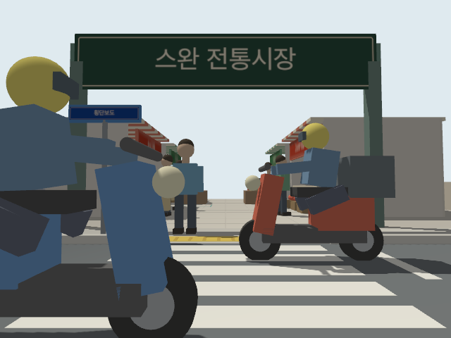
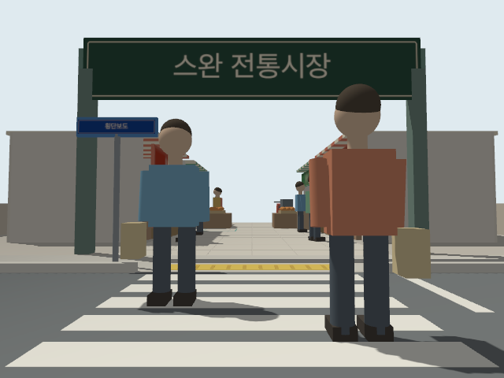

# 시장 검증 요약

## 실제 Gazebo 실행 — v4 장면

ROS2 Jazzy / Gazebo Harmonic / UTM llvmpipe 환경에서 빌드·SDF 검사를 통과했다.
시뮬레이션 시간 51.96초 동안 실제 모델 위치를 수신했고, 위치 갱신 979회 중 실패는 0회였다.
보행자 2명의 횡단·복귀와 오토바이 2대의 다음 순환 시작을 확인했다.
두 장면에서 카메라 영상과 720개 샘플의 LiDAR 데이터를 수신했다.

이는 공통 런처 개편 전 실행 결과다. 공통 런처의 실제 Gazebo 재실행은 VM이 꺼져 있어 미검증 상태다.
오프라인 테스트 12개로 월드 선택·로봇 중복 생성 방지·브리지 설정 등을 검사했다.

## 형상 검사 범위

2주기를 0.05초 간격으로 검사한 1,281개 표본에서 이동 모델 간 및 정적 장애물과
2D 충돌 형상이 겹치지 않았다. 최소 간격은 정적 장애물 0.385m, 이동 모델 간 0.57m다.
이 검사는 휠체어와 접촉 물리를 제외한다. 정적 통로 검사 또한 이동 교통을 제외한다.
따라서 자율주행·동적 장애물 회피가 검증됐다는 의미는 아니다.

## 정리한 기록 찾기

중복 스크린샷, 원시 CSV/JSON, v1~v3 로그와 현재 이동 시나리오에 사용할 수 없는
옛 정적 주행 시험·보고서 스크립트는 현재 파일 목록에서 제거했다. Git 이력에는 남아 있다.

- [정리 전 검증 자료 전체](https://github.com/pdy606/swan/tree/b9ff9fb6411c7ed12b44e9a95e31f691db0dc3f8/src/swan_market/preview)
- [정리 전 시험 도구](https://github.com/pdy606/swan/tree/b9ff9fb6411c7ed12b44e9a95e31f691db0dc3f8/src/swan_market/tools)

과거의 v2 시장 내부 주행과 v3 횡단보도 주행은 이동 교통 도입 전 기록이다.
다시 실행할 때는 당시 코드를 별도 작업 폴더에서 사용해야 한다.
새 검사 산출물은 `src/swan_market/preview/`에 생성되며 Git에 포함하지 않는다.
